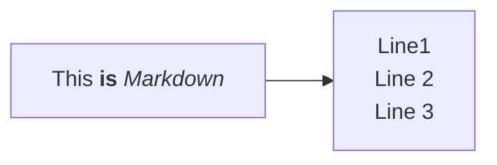
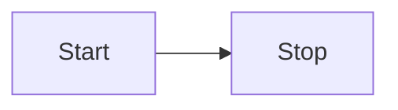
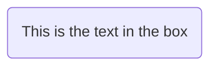
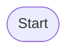
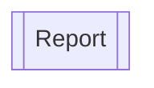
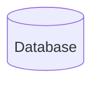

```mermaid
%%{init: {"flowchart": {"htmlLabels": false}} }%%
flowchart LR
    markdown["`This **is** _Markdown_`"]
    newLines["`Line1
    Line 2
    Line 3`"]
    markdown --> newLines
```

```mermaid
flowchart LR
    Start --> Stop
```

```mermaid
flowchart LR
    id1(This is the text in the box)
```

```mermaid
flowchart LR
    id1([Start])
```

```mermaid
flowchart LR
   id1[[Report]]
```

```mermaid
flowchart LR
     id1[(Database)]
```
